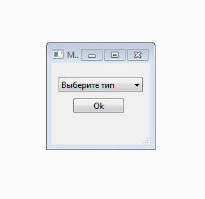

# BotHelper

A program for creating a bot project

## Files

Maket - The folder with the layouts of the main files

Versions - Version archive folder

## Adding a template

1. In the Maket folder, create a main file named: type + _maket.py (type is the name of the library or platform).
2. Add conditional branching in mainwindow.cpp file.
3. Create a QT designer form class
4. The type.py file (type is the name of the library or platform) should look like this:
```c++
void type::on_pathButton_clicked()
{
    QString path = QFileDialog::getExistingDirectory(0, "Directory Dialog", "");
    ui->pathButton->setText(path);
}


void type::on_buttonBox_clicked()
{
    QString textToken = your text token
    help_function::easy_file("type", textToken, "\\main.py", ui->pathButton->text());
}
```
## Versions

1.0 - Added templates for telegram (telebot) and discord

## Preview


**By MrDlop**
